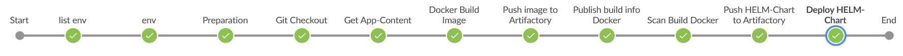

#

Deegree Helm Charts für Kubernetes Cluster
==========================================

## Inhalt
* [Einleitung](#einleitung)
* [Deegree Workspace](#deegree-workspace)
* [Docker Image](#docker-image)
* [Helm Chart](#helm-chart)
* [Ausblick](#ausblick)


## Einleitung
Im Repository [deegree-kubernetes](https://github.com/enatdvmv/deegree-kubernetes) haben wir unseren Content noch direkt über *kubectl* dem Kubernetes-Cluster hinzugefügt. Das werden wir nun über einen Helm-Chart bewerkstelligen. Der Helm-Chart wird über unsere Jenkins-Pipeline in ein Artifactory gespeichert und auf dem Kubernetes-Cluster deployed.

Wir sind im Repository [deegree-kubernetes](https://github.com/enatdvmv/deegree-kubernetes) zu der Erkenntnis gelangt, die Lösung so einfach wie möglich zu halten. Deshalb bauen wir hier ein komplettes Docker-Image mit *tomcat:9-jdk8*, einer deegree WebApp und einem deegree Workspace.


## Deegree Workspace
Für den deegree [Workspace](workspaces) verwenden wir wiederum einen View- und einen Download-Service zum INSPIRE Thema GovernmentalService. Sämtliche XSD-Schemata werden lokal im deegree Workspace unter *appschemas* vorgehalten. Diese sind in diesem Repository nicht publiziert, können aber mit Hilfe des Python-Clients [local-schemas](https://github.com/enatdvmv/local-schemas) bereitgestellt werden.


## Docker Image
Für den Imagebau in der Pipeline verwenden wir das [Dockerfile](Dockerfile). Das aktuelle *deegree-webservices.war* laden wir zuvor in der Pipeline herunter und entpacken es. Alternativ könnte dies auch im Dockerfile geschehen.


Abb. 1: Steps Jenkins-Pipeline

```
stage('Get App-Content') {
            environment { 
                DEEGREE_VERSION = "3.4.23"
            }
            steps {
                echo "Get deegree App Content from Artifactory..."
                sh "curl https://repo.deegree.org/content/repositories/public/org/deegree/deegree-webservices/${env.DEEGREE_VERSION}/deegree-webservices-${env.DEEGREE_VERSION}.war -o deegree-inspire.war"
		sh "unzip -q deegree-inspire.war -d ./deegree-inspire/"
		sh "rm -r ./deegree-inspire.war"
		sh "cp ./prod/context.xml ./deegree-inspire/META-INF/context.xml"
		sh "cp ./prod/rewrite.config ./deegree-inspire/WEB-INF/rewrite.config"
            }
}
		
stage('Docker Build Image') {
            steps {
                echo "building Docker image..."
                script {
                    def dockerfile = 'Dockerfile'
                    pomVersion = sh(returnStdout: true, script: 'mvn help:evaluate -Dexpression=project.version -q -DforceStdout').trim()
                    dockerImageName = "${DOCKER_REGISTRY}/docker-dev/deegree-inspire:${pomVersion}"
			def customImage = docker.build("${dockerImageName}", "-f ${dockerfile} --build-arg target_app=deegree-inspire --build-arg target_workspace=deegree-inspire-workspace .")
                }
            }
}
```


## Helm Chart
Anstatt den Kubernetes Content direkt über *kubectl* dem Cluster hinzuzufügen, verwenden wir hier einen [Helm-Chart](helm-chart/deegree-inspire). Dazu werden die Kubernetes Konfigurations-Files zu [Templates](helm-chart/deegree-inspire/templates) um modelliert und mit den Werten der Datei [values.yaml](helm-chart/deegree-inspire/values.yaml) ersetzt. Folgende Kubernetes Objekte legen wir hiermit an:
* Deployment
* Horizontal Pod Autoscaler
* Secret
* Service
* Service Account
* Ingress

Das Deployment erfolgt in der Pipeline. Könnte aber auch direkt mit dem cli *helm* im Namespace *deegree* erfolgen.
```
kubectl config use-context deegree
helm lint deegree-inspire
helm upgrade --install deegree-inspire ./deegree-inspire --namespace deegree  --create-namespace
helm ls
```
Schauen wir uns nun den Pod, den Horizontal Pod Autoscaler sowie die Nodes an.
```
kubectl get pods
kubectl get hpa
kubectl describe nodes
```
Wechseln auf eine vorherige Version (*hier z.B. auf Version 1*).
```
helm rollback deegree-inspire 1
```
Deinstallieren den Helm-Chart.
```
helm uninstall deegree-inspire
```
Und sehen uns anschließend noch die Einhaltung der Kyverno-Regeln an.
```
kubectl get policyreport -A
kubectl describe policyreport polr-ns-deegree -n deegree
```
Da die Regel *readOnlyRootFilesystem: true* zu erfüllen ist, werden der deegree Workspace wie auch sämtliche Tomcat-Unterverzeichnisse, auf die schreibend zugegriffen wird, im Deployment über Volume Mounts (*emptyDir*) abgebildet.

Auf die deegree Konsole greifen wir über die Ingress-IP zu. URL: http://ingress-ip/deegree-webservices/console/webservices/index.xhtml

Und testen die beiden deegree Web-Services (WMS und WFS) in QGIS. bzw. den WFS über einen GetFeature-Request.
URL: http://ingress-ip/deegree-webservices/services/inspire_us_schulstandorte_download?service=WFS&version=2.0.0&request=GetFeature&typeName=us-govserv:GovernmentalService&Count=1

Noch ein Wort zum Horizontal Pod Autoscaler. Dieser ermöglicht es, die Anzahl der Pods in Abhängigkeit von der CPU und der Memory Auslastung zu steuern. In diesem Fall läuft mindestens 1 Pod auf den Nodes. Ein zweiter Pod wird gestartet, sobald die Auslastung des laufenden Pods hier 85% der CPU oder 80% des Memorys erreicht (*apiVersion: autoscaling/v2beta2*).


## Ausblick
Wie wir gesehen haben, vereinfacht Helm das Deployment von Kubernetes Anwendungen erheblich. Es bietet auch eine Versionsverwaltung mit Rollback-Funktion. Im Repository [k8s-cronjob](https://github.com/enatdvmv/ k8s-cronjob) werden wir noch einen Kubernetes CronJob anlegen, der regelmäßig einen GetFeature bzw. GetMap auf unsere deegree WebServices absetzt.
